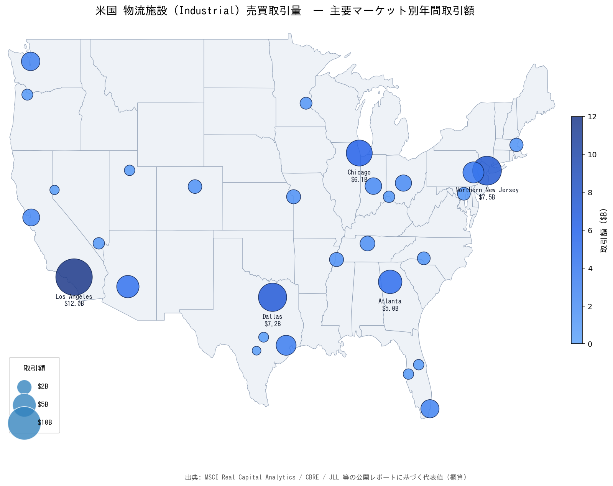

# 米国 物流施設（Industrial）売買取引量マップ

主要米国物流マーケットの年間取引額を円サイズで表現し、
Interstate 主要高速道路・鉄道網を重ねた可視化です。



## ファイル

| ファイル | 内容 |
|---|---|
| [`us_industrial_transactions_map.png`](./us_industrial_transactions_map.png) | 静的画像（デッキ・ドキュメント貼付用） |
| [`us_industrial_transactions_map.html`](./us_industrial_transactions_map.html) | Plotly インタラクティブ版（ホバーで詳細） |
| [`build_map_png.py`](./build_map_png.py) | PNG 生成スクリプト |

## データ

- **取引額**: MSCI Real Capital Analytics / CBRE / JLL 等の公開レポートに基づく代表値（概算, $B）
- **州境**: US States GeoJSON (PublicaMundi)
- **高速道路・鉄道**: Natural Earth 1:10m Cultural Vectors

## 再生成

```bash
# 依存データ
curl -o /tmp/us_states.json https://raw.githubusercontent.com/PublicaMundi/MappingAPI/master/data/geojson/us-states.json
curl -o /tmp/ne_roads.json  https://raw.githubusercontent.com/nvkelso/natural-earth-vector/master/geojson/ne_10m_roads.geojson
curl -o /tmp/ne_rail.json   https://raw.githubusercontent.com/nvkelso/natural-earth-vector/master/geojson/ne_10m_railroads.geojson

# 生成
pip install matplotlib
python3 build_map_png.py
```
